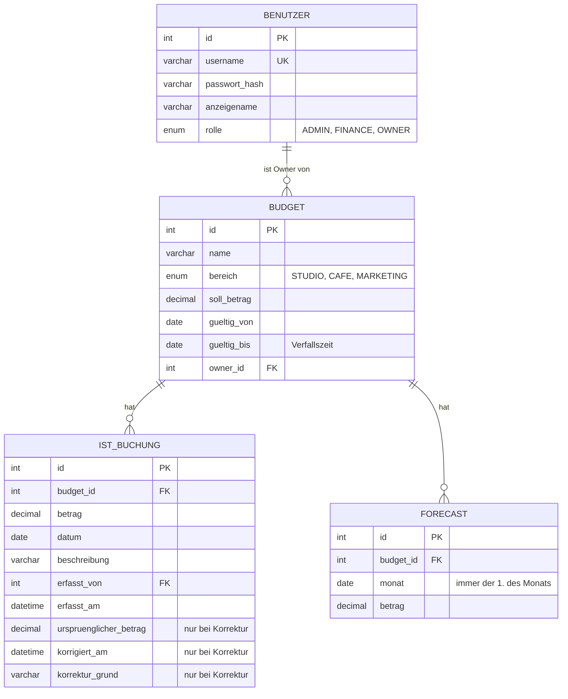

# Fachkonzept – Maliá Budget

## 1. Umfang

**Grundsystem** (Aufgabe II) + **Ausprägung Owner-Sicht** (Aufgabe III). Bewusst schlank gehalten (E-009).

| Anforderung (Folien) | Umsetzung | Karte |
|---|---|---|
| Datenbank zur Speicherung | MariaDB (XAMPP), `database/schema.sql` | MB-004 |
| Erfassen von Ist-Werten | Owner-Formular | MB-034 |
| Korrigieren von Ist-Werten | Korrektur mit Grund und Originalbetrag | MB-035 |
| Anzeige Soll-Ist-Vergleich | Finance-Übersicht, Owner-Detailseite | MB-032, MB-041 |
| Eintragen / Zuweisen neuer Budgets | Finance-Formular | MB-031 |
| Anlegen von Benutzern, Rollen zuweisen | Admin-Formular | MB-030 |
| Verfallszeiten | `gueltig_bis` je Budget, danach gesperrt | MB-045 |
| 3 Rollen fix im Code | Java-`enum Rolle` | MB-021 |
| Zugang per Username & Passwort | Spring Security, BCrypt | MB-020 |
| Logische Trennung der Daten | Owner sieht nur eigene Budgets | MB-022 |
| Owner: Statusanzeige | Dashboard mit Status je Budget | MB-040 |
| Owner: alle aktuellen Ausgaben | Budget-Detailseite | MB-041 |
| Owner: verfügbares Budget | Detailseite + Dashboard | MB-040, MB-041 |
| Owner: Forecast eintragen / anzeigen | Forecast pro Monat | MB-042 |
| Owner: Soll-Ist-Vergleich (grafisch) | Chart.js-Diagramm | MB-043 |
| Owner: Forecast-Ist-Soll-Vergleich | Hochrechnung + Diagramm | MB-044 |
| Owner: Auswertung in „Echtzeit“ | jede Seite rechnet beim Aufruf live aus der DB | MB-041 |

## 2. Rollen und Rechte

| Funktion | Admin | Finance | Owner |
|---|:-:|:-:|:-:|
| Benutzer anlegen, Rolle zuweisen | ✔ | | |
| Budget anlegen / bearbeiten / Owner zuweisen | | ✔ | |
| Alle Budgets + Soll-Ist sehen | | ✔ | |
| Eigene Budgets sehen | | | ✔ (nur eigene) |
| Ausgaben erfassen / korrigieren | | | ✔ (nur eigene Budgets) |
| Forecast eintragen | | | ✔ (nur eigene Budgets) |

Zugriffsschutz auf **zwei Ebenen**:
1. URL-Regeln: `/admin/**`, `/finance/**`, `/owner/**` nur für die passende Rolle
2. Im Code: Jede Owner-Seite lädt das Budget über `ladeEigenesBudget(id, benutzer)`.
   Gehört es jemand anderem → 403. So hilft es nicht, die ID in der URL zu ändern.

## 3. Datenmodell

- Forecast: pro `(budget_id, monat)` genau ein Eintrag (`UNIQUE`); neu eintragen überschreibt.
- Benutzer werden nicht gelöscht (Ausgaben verweisen auf sie).

## 4. Kennzahlen und Status

| Kennzahl | Formel |
|---|---|
| Ist | Summe aller Ausgaben des Budgets |
| Verfügbar | Soll − Ist |
| Verbrauch % | Ist / Soll × 100 |
| Offener Forecast | Summe Forecast ab dem aktuellen Monat bis Budgetende |
| Hochrechnung | Ist + offener Forecast |

| Status | Bedingung (von oben nach unten prüfen) | Farbe |
|---|---|---|
| Abgelaufen | heute > `gueltig_bis` | grau |
| Überschritten | Ist > Soll | rosé |
| Warnung | Verbrauch ≥ 80 % **oder** Hochrechnung > Soll | ocker |
| Im Rahmen | sonst | salbei |

Zusätzlich wird überall „noch X Tage“ bis zum Verfall angezeigt.

## 5. Demo-Daten (Maliá)

| Benutzer | Rolle | Budgets |
|---|---|---|
| `admin` | Admin | – |
| `finance` | Finance (Buchhaltung) | – |
| `studio` | Owner (Studio-Leitung) | Reformer-Wartung 2026 (4.800 €), Kursmaterial & Kleingeräte (2.500 €), Trainer-Fortbildung (3.000 €) |
| `cafe` | Owner (Café-Leitung) | Café-Wareneinkauf Q4 (12.000 €), Café-Ausstattung Siebträger (6.500 €) |
| `marketing` | Owner (Marketing) | Social Media & Fotoshooting (2.000 €), Frühlings-Event (1.500 €, abgelaufen) |

Die Daten so wählen, dass jeder Status mindestens einmal vorkommt.

## 6. Design (aus der Maliá-Website)

| Token | Wert | Verwendung |
|---|---|---|
| `--paper` | `#fffdfa` | Seitenhintergrund |
| `--cream` | `#f3eee5` | Karten, Flächen |
| `--ink` | `#49443e` | Text |
| `--muted` | `#7c776f` | Nebentext |
| `--sage` / `--sage-deep` | `#8d9b7f` / `#728267` | Primärfarbe, „im Rahmen“ |
| `--rose` | `#c99388` | Akzent, „überschritten“ |
| `--line` | `#e5dfd4` | Linien, Rahmen |
| `--serif` | Instrument Serif | Überschriften, große Zahlen |
| `--sans` | DM Sans | Fließtext, Formulare |

Quelle: `WebProgrammierung-neuaufbau/src/index.css` und `src/modern.css` (Schatten).
Bilder wie `malia-reformer-flow.jpg` oder `malia-cafe.jpg` können übernommen werden.
